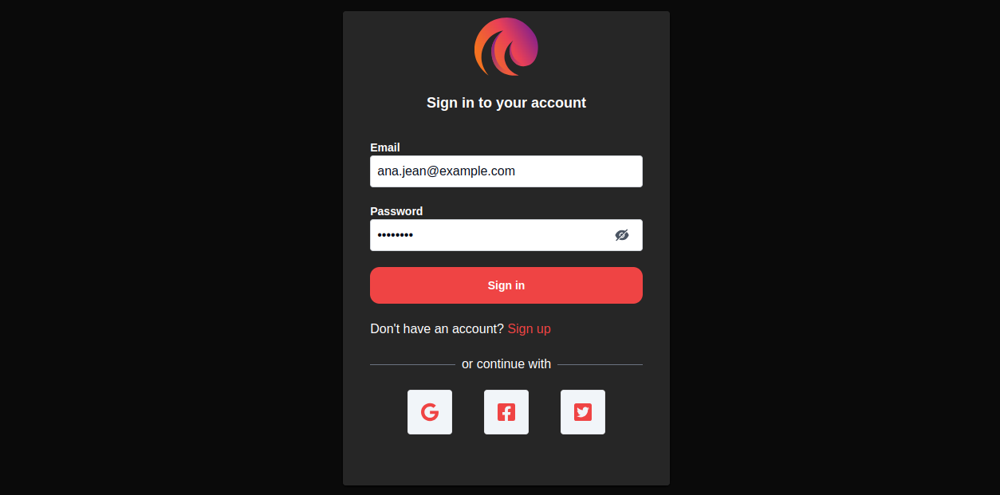
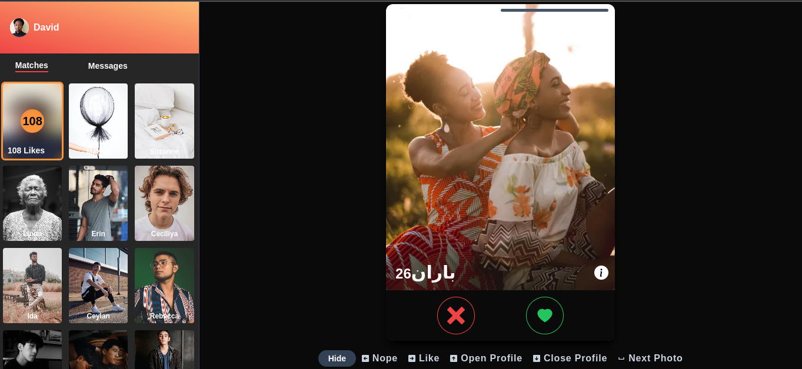
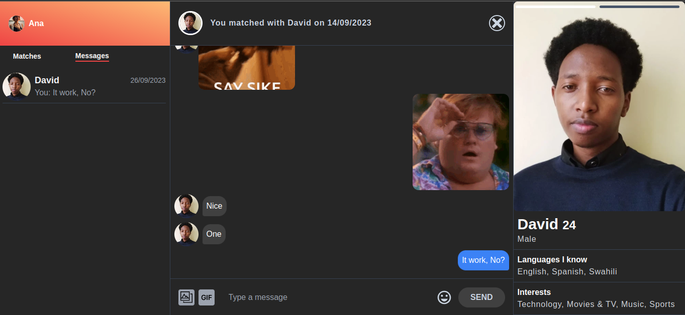
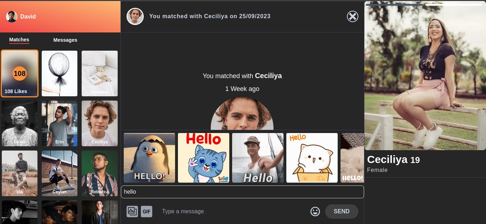

# SoulSpark: Online Dating Web Application

SoulSpark is tinder-inspired online dating web application designed to bring people together. Whether you're looking for love, friendship, or meaningful connections, SoulSpark provides a platform to connect with like-minded individuals. This project combines the power of Express, Prisma, React.js, Tailwind CSS, and Pusher for real-time messaging to create a dynamic and interactive experience.

## Technologies Used

- **Backend**:

  - Express.js: A fast and minimal web application framework for Node.js.
  - Prisma: A modern database toolkit for Node.js and TypeScript.
  - PostgreSQL: A powerful, open-source relational database system.

- **Frontend**:

  - React.js: A JavaScript library for building user interfaces.
  - Tailwind CSS: A utility-first CSS framework for rapidly building custom designs.

- **Real-Time Messaging**:

  - Pusher: A service for adding real-time functionality to web and mobile applications.

- **Digital Assets storage**

  - Cloudinary: A service for storing,managing and transforming digital assets programmatically.

## Features

- User Registration and Authentication.
- User Profile Creation and Customization.
- Browse and Match with Other Users.
- Real-Time Messaging for Seamless Conversations (Powered by Pusher).
- Integration with tenor api to send gif messages.
- Integration with cloudinary to send images.
- **[TODO]** Swiping Animation for Intuitive Matching.
- **[TODO]** Location-Based Matching for Nearby Users.
- **[TODO]** Free and Premium User Accounts with Additional Features.
- **[TODO]** NSFW content detection.
- **[TODO]** Update profile feature.

## Screenshots

